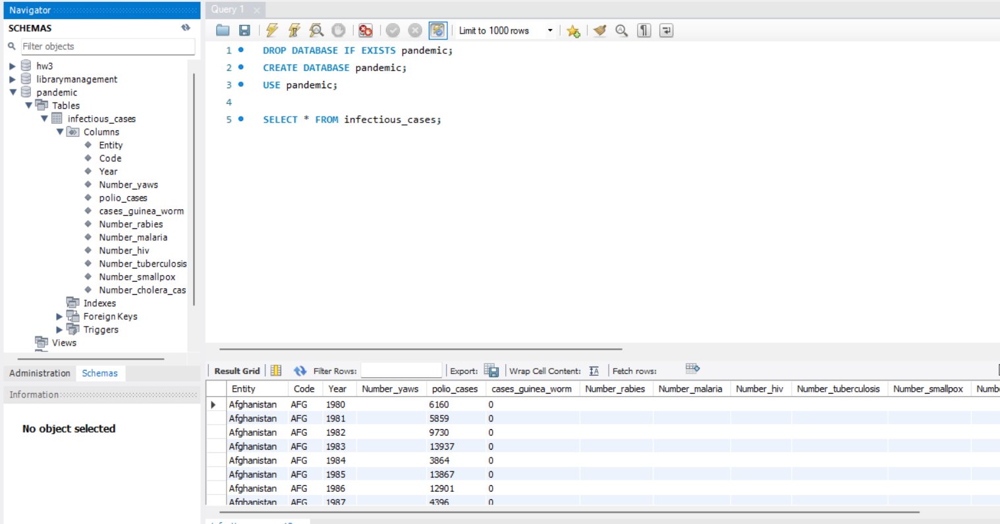
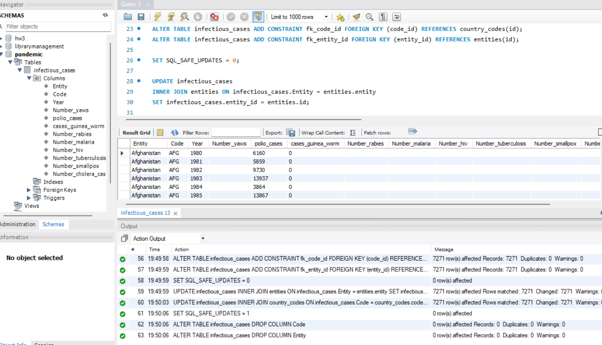
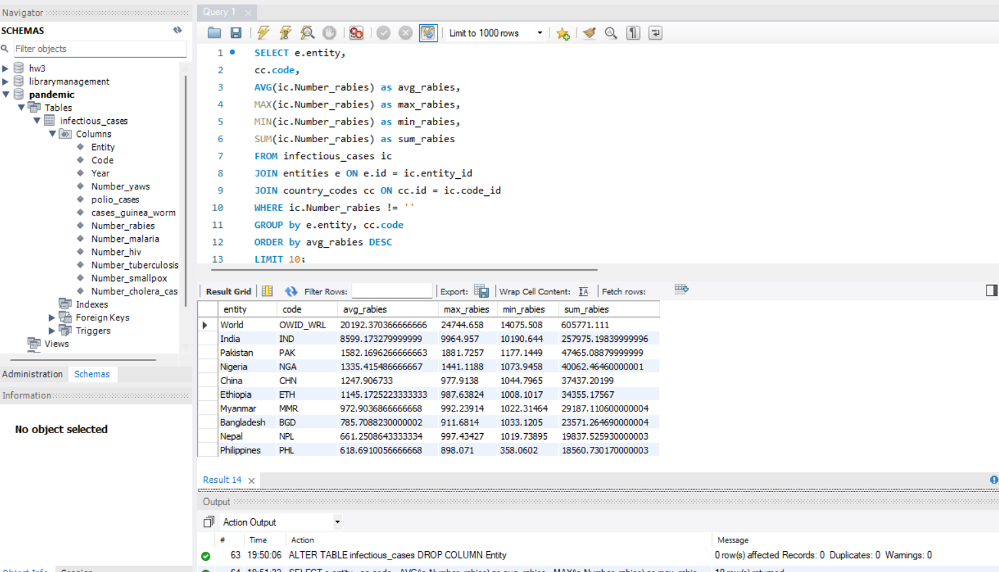
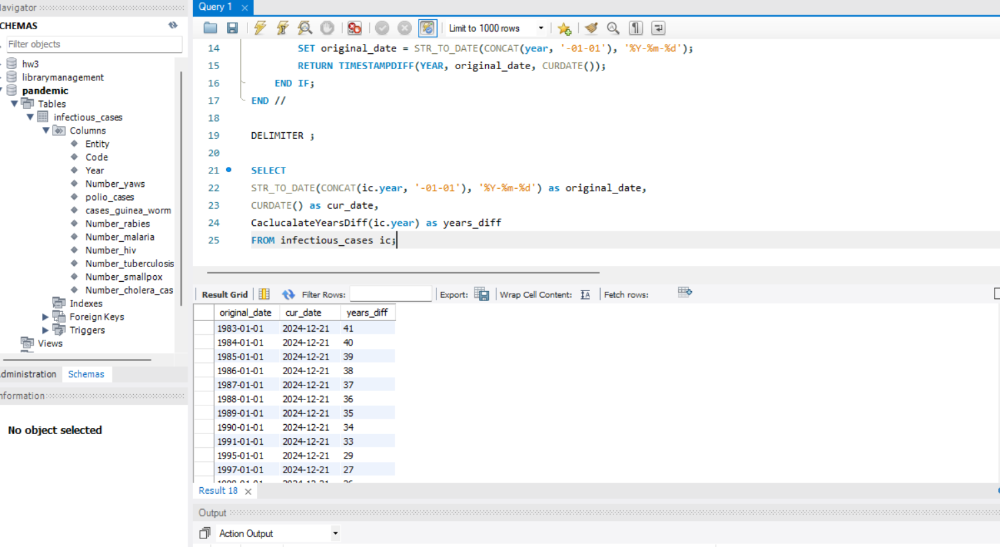
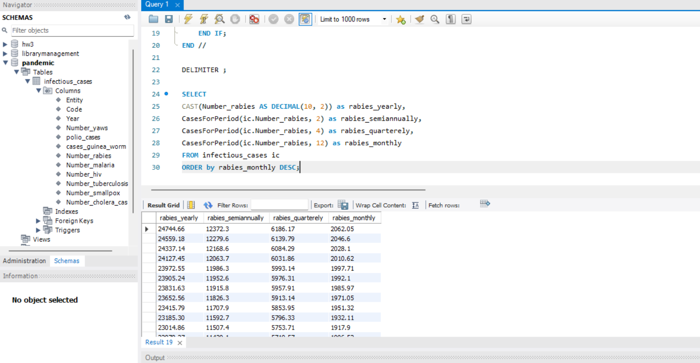

# goit-rdb-fp

## Task 1

Завантажте дані:

- Створіть схему pandemic у базі даних за допомогою SQL-команди.
- Оберіть її як схему за замовчуванням за допомогою SQL-команди.
- Імпортуйте дані за допомогою Import wizard так, як ви вже робили це у темі 3.

[Task 1](p1.sql)

## Task 2

Нормалізуйте таблицю infectious_cases до 3ї нормальної форми. Збережіть у цій же
схемі дві таблиці з нормалізованими даними.

[Task 2](p2.sql)

## Task 3

Проаналізуйте дані:

- Для кожної унікальної комбінації Entity та Code або їх id порахуйте середнє,
  мінімальне, максимальне значення та суму для атрибута Number_rabies.
- Врахуйте, що атрибут Number_rabies може містити порожні значення `''` — вам
  попередньо необхідно їх відфільтрувати.
- Результат відсортуйте за порахованим середнім значенням у порядку спадання.
- Оберіть тільки 10 рядків для виведення на екран.

[Task 3](p3.sql)

## Task 4

Побудуйте колонку різниці в роках.

Для оригінальної або нормованої таблиці для колонки Year побудуйте з
використанням вбудованих SQL-функцій:

- атрибут, що створює дату першого січня відповідного року (Наприклад, якщо
  атрибут містить значення '1996', то значення нового атрибута має бути
  '1996-01-01'.)
- атрибут, що дорівнює поточній даті.
- атрибут, що дорівнює різниці в роках двох вищезгаданих колонок.

[Task 4](p4.sql)

## Task 5

Побудуйте власну функцію.

- Створіть і використайте функцію, що будує такий же атрибут, як і в
  попередньому завданні: функція має приймати на вхід значення року, а повертати
  різницю в роках між поточною датою та датою, створеною з атрибута року (1996
  рік → '1996-01-01').

[Task 5.1](p5.1.sql)

## Task 5 \*

Побудувати функцію, що рахує кількість захворювань за певний період. Для цього
треба поділити кількість захворювань на рік на певне число: 12 — для отримання
середньої кількості захворювань на місяць, 4 — на квартал або 2 — на півріччя.
Таким чином, функція буде приймати два параметри: кількість захворювань на рік
та довільний дільник. Ви також маєте використати її — запустити на даних.
Оскільки не всі рядки містять число захворювань, вам необхідно буде відсіяти ті,
що не мають чисельного значення (≠ `''`).

[Task 5.2](p5.2.sql)

